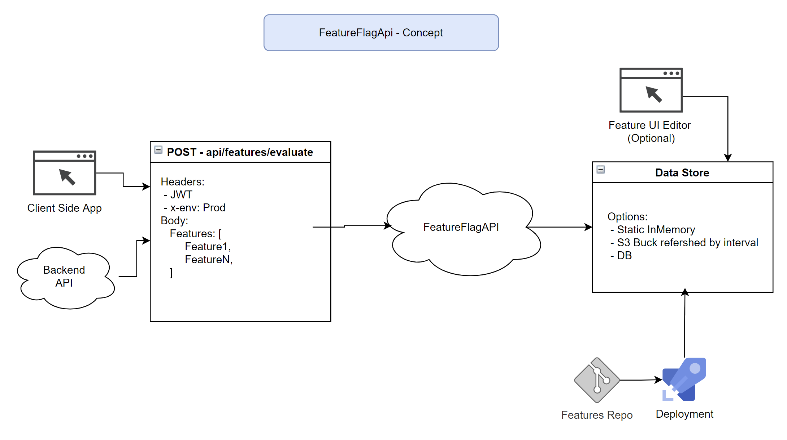

# Development FeatureFlagAPI

## What is it?
1) A cross cutting concern.
   - Meaning Application, Product, or Module egnostic.
   - Said differently: A single FeatureFlagAPI can service multiple applications or environments depending on your needs.
2) Allows for speed of development by hide/show UI elements or running new/old code paths.
3)  It's a short-term toggle for an on going feature.
    - Once the feature is General Availability (GA) the flag wrapping the code should be removed.

## What is it not?
1) It does not check or enforce any security.
2) It does not check or enforce a billable feature set.

## What does it look like?

